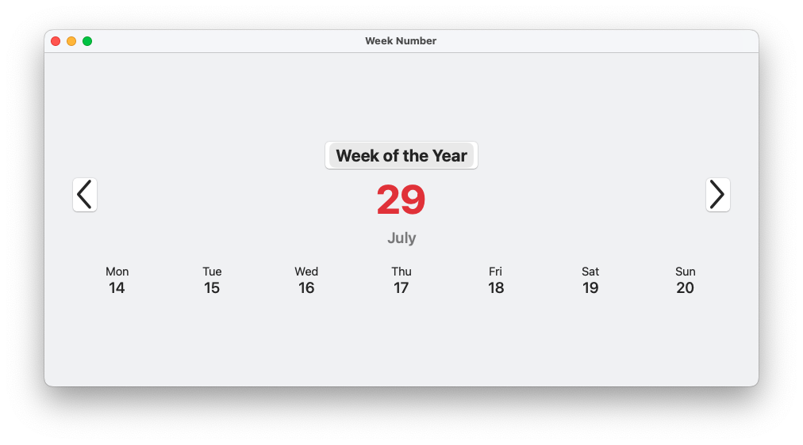
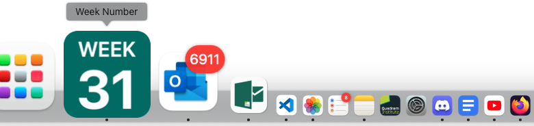

# Week Number

  

A simple macOS application that displays the current week of the year, updating its **dock icon** to display the Week Number.

The icon in the Dock updates live:

## Installation

To compile this application, you will need Xcode.

1.  Clone the repository.
2.  Open `Week Number.xcodeproj` in Xcode.
3.  Build the project (Product > Build).

